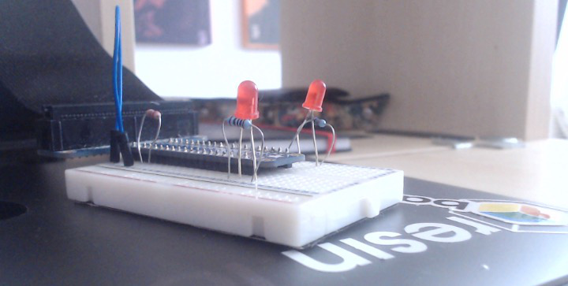

# A Pi API (.py)

A simple API to provide a REST interface to the pins of a Raspberry Pi.

## Getting Started

1) The first few steps of this are covered by the [resin.io getting started guide](https://docs.resin.io/learn/getting-started/raspberrypi3/python/), tweaked very slightly.
   * Clone and push this repo instead of the getting started repo. Once you get to the bottom of that, come back here.
1) Configure the fleet with the environment variable `AUTH_NONE` as `asdf`.  **This is not recommended for production, see Authorization section below!**
1) Grab some breadboard, some LEDs and stuff.
   * For my rather basic test I simply used [a t-cobbler, two leds, a piece of wire as a switch and some resistors](apiapi.jpg).
   * Plug them all together. My LEDs are simply in series with a protection resistor straight out of the pins. My input is a jumper wire and a pull-down resistor measured somewhere in the megaOhms.
1) Enable `PUBLIC DEVICE URL`, and visit it; this will take you to the UI which has documents on each endpoint and a `Try it out!` for each.
1) You are now reading and controlling real world components over the cloud with an easily upgradeable infrastructure. This could be relays with mains voltage (*be careful!*) lamps, water level monitors or whatever on/off components you wish!

## Endpoint Overview

* `GET` an individual pin on `/pin/{id}`
* `PUT` an individual pin on `/pin/{id}`
* `GET` all the pins on `/pins`
* `PATCH` a subset of the pins on `/pins`
* `GET` a ping on `/status`

## Authorization

At the moment this codebase supports the configuring of one shared secret. When a request comes in the codebase will hash the value in the `Authorization` header and compare this to the provided value.

The best of the following environment variables will be used:
1) `AUTH_SHA256`
1) `AUTH_SHA1`
1) `AUTH_MD5`
1) `AUTH_PLAIN` - compares directly, without any one way encryption
1) `AUTH_NONE` - instructs the device to allow all requests

## Endpoint Details

Full details of endpoints can be found in
[the swagger spec](/src/v0/spec.yml)
